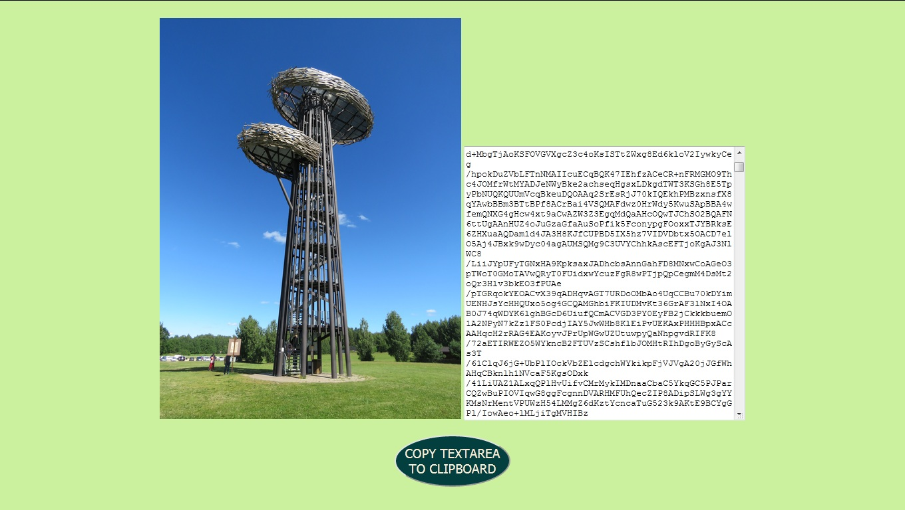

# Image-to-Base64
Application to convert imagest into base64 format. Written in HTML, JS, CSS


## Base64
Base64 is a group of binary-to-text encoding schemes that represent binary data (more specifically a sequence of 8-bit bytes) in an ASCII string format by translating it into a radix-64 representation. The term Base64 originates from a specific MIME content transfer encoding. Each non-final Base64 digit represents exactly 6 bits of data. Three 8-bit bytes (i.e., a total of 24 bits) can therefore be represented by four 6-bit Base64 digits. 

https://en.wikipedia.org/wiki/Base64
https://developer.mozilla.org/en-US/docs/Glossary/Base64



## Size function
There is a image resize function on page body onload to fit larger images on screen.

```
        function setImageSize(){
            var img = document.getElementById('img')
            var x = screen.width / 3
            var y = img.width / x
            var z = img.height / y

            img.style.width = x.toString() + 'px'
            img.style.height = z.toString() + 'px'
        }
```

# HAPPY CODING !!!


